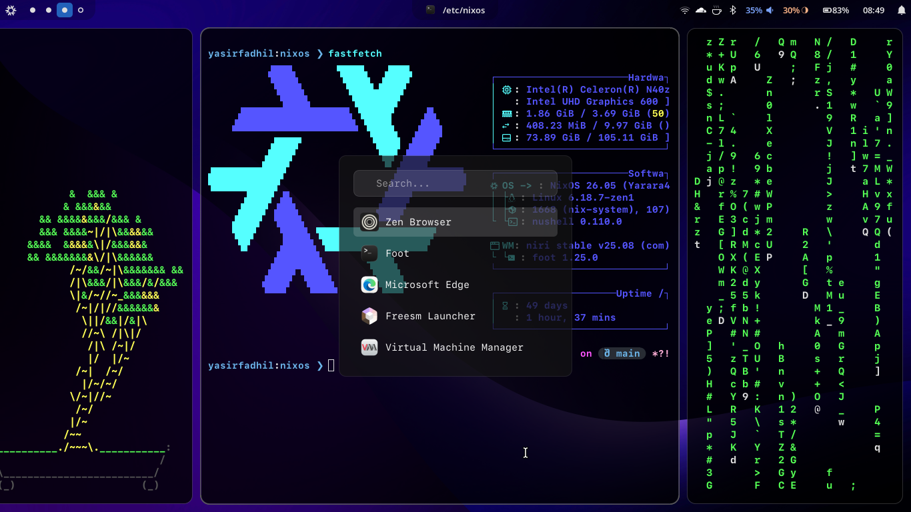

# NIXKs

<div style="display: flex; align-items: center; gap: 20px;">
  
  <span style="font-size: 40px; font-weight: bold;">+</span>
  
</div>

Is my new config for [NixOS](https://nixos.org/) configuration using [Flakes](https://nixos.wiki/wiki/Flakes) with [Niri](https://github.com/YaLTeR/niri) compositor and [Home Manager](https://github.com/nix-community/home-manager).

<!--## Features

- 🪟 **Wayland-First** - Niri compositor with Hyprland support
- 📦 **Flakes-Based** - Reproducible builds with locked dependencies
- 🏠 **Home Manager** - Declarative user environment
- 🎨 **Pre-configured** - Zed, Zen Browser, Spicetify, Nushell, and more
- 🔧 **Modular** - Easy to customize and maintain-->

## Documentation

- **[INSTALL.md](INSTALL.md)** - Installation and setup guide
- **[KEYBINDINGS.md](KEYBINDINGS.md)** - Niri keybindings reference

## Screenshots



## Directory Structure

```
.
├── flake.nix                  # Flake configuration
├── host/chromebook/           # Hardware-specific config
├── nixos/                     # System configuration
├── home/                      # Home Manager configuration
│   ├── programs/              # Program configs
│   ├── systems/niri/          # Niri compositor
│   └── themes/                # Theme customization
└── KEYBINDINGS.md             # Niri shortcuts
```

## Resources

- [NixOS Manual](https://nixos.org/manual/nixos/stable/)
- [Home Manager](https://nix-community.github.io/home-manager/)
- [Niri Documentation](https://github.com/YaLTeR/niri)
- [NixOS Wiki](https://nixos.wiki/)

---

> Made with ❤️ by [YasirFadhil](https://github.com/YasirFadhil)
