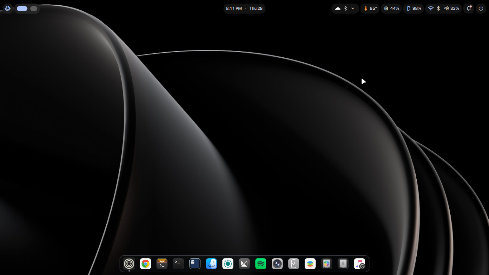
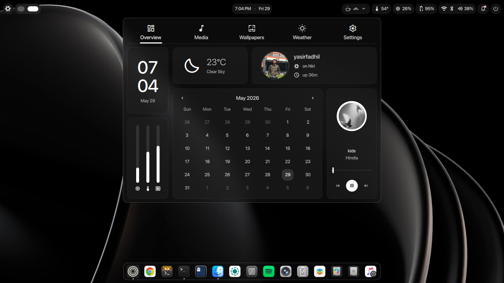

# NIXKs

<div align="center">
  

Minimal and modular NixOS configuration using Flakes, Home Manager, and the Niri compositor.
Built for a clean Wayland workflow with a macOS-inspired aesthetic.
</div>

---

## Overview

NIXKs is my personal NixOS setup focused on:

- Declarative and reproducible configuration
- Modular system structure
- Wayland-first desktop experience
- Lightweight but modern workflow
- Easy customization and maintenance

This setup currently uses:

- [NixOS](https://nixos.org/)
- [Flakes](https://nixos.wiki/wiki/Flakes)
- [Home Manager](https://github.com/nix-community/home-manager)
- [Niri](https://github.com/YaLTeR/niri)
- [DMS](https://github.com/AvengeMedia/DankMaterialShell)

---

## Documentation

| File | Description |
|------|-------------|
| [INSTALL.md](INSTALL.md) | Installation and setup guide |
| [KEYBINDINGS.md](KEYBINDINGS.md) | Niri keybindings reference |

---

## Directory Structure

```txt
.
├── flake.nix
├── host/
│   └── chromebook/
├── nixos/
├── home/
│   ├── programs/
│   ├── systems/
│   ├── themes/
│   └── scripts/
└── README.md
```

---

## Features

- Modular NixOS configuration
- Home Manager integration
- Niri compositor setup
- Reusable theming system
- Multiple shell configurations
- Custom scripts and utilities
- Chromebook-friendly setup

---

## Screenshots

> [!IMPORTANT]
> The screenshots shown here use my personal Quickshell + Dank Shell setup. Parts of the interface are configured manually and are not fully managed by this NixOS configuration. As a result, your desktop may look slightly different after installation.

### Desktop Environment
<div align="center">
  
  <p><em>Clean desktop with Niri compositor and DMS shell</em></p>
</div>

### Dashboard
<div align="center">
  
  <p><em>DMS dashboard with weather, calendar, and media controls</em></p>
</div>

### Additional Features
- **App Launcher**: Quick access application menu with DMS
- **Lock Screen**: Custom styled lock screen with DMS
- **System Info**: FastFetch system information display
- **Theme Settings**: Dank Material Shell (DMS) configuration options

---

## Resources

- [NixOS Manual](https://nixos.org/manual/nixos/stable/)
- [Home Manager](https://nix-community.github.io/home-manager/)
- [Niri Wiki](https://github.com/YaLTeR/niri/wiki)
- [NixOS Wiki](https://nixos.wiki/)
- [DMS](https://github.com/AvengeMedia/DankMaterialShell)

---

## License

This project is licensed under the MIT License.

---

<div align="center">
Made by <a href="https://github.com/YasirFadhil">YasirFadhil</a>
</div>
